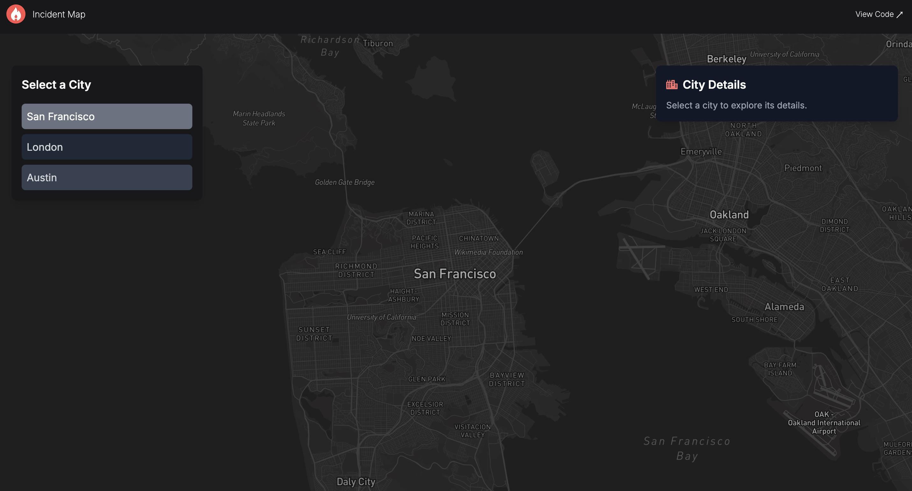
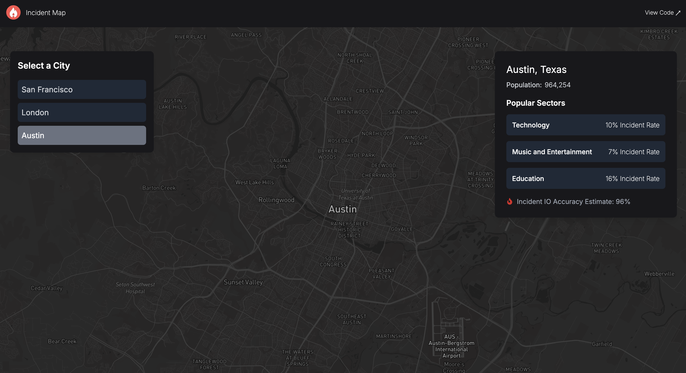

## Incident Map 

This app allows users view incident data by city. 

The data is not accurate, but it demonstrates how incident data could display in the future.

Link: [Live Demo](https://github.com/)  

> Note: Please allow up to 30 seconds for the site to load - it's hosted for free. 

---

## Functionality

### 1. **Landing Page**  
Click on a city to view the sectors with the highest incident rates.

### 2. **View Data**  
View the incident rates per sector.

## Housekeeping

The data in the project is not vetted for accuracy. 